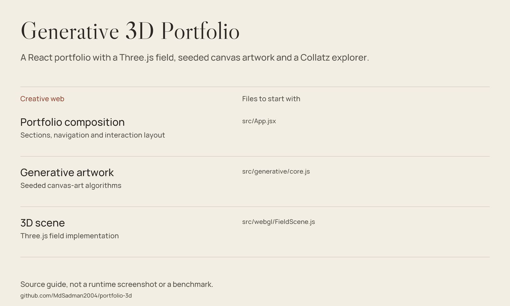

# Generative 3D Portfolio

A React portfolio with a Three.js field, seeded canvas artwork and a Collatz explorer.



*Source guide drawn from the files in this repository; not a runtime screenshot or a fresh benchmark.*

[Getting started](#getting-started) · [Source guide](#source-guide) · [Scope & limitations](#scope--limitations)

## What is here

A personal portfolio implemented with React and Three.js. The interface combines a WebGL field, deterministic seeded canvas artwork, a skill constellation, project narratives and a Collatz explorer.

- **Edit the content:** [src/data/content.js](src/data/content.js).
- **Explore the art generators:** [src/generative/core.js](src/generative/core.js).
- **Inspect the Collatz interface:** [src/components/CollatzOracle.jsx](src/components/CollatzOracle.jsx).

## Getting started

Use Node.js and npm compatible with the declared Vite 5 dependencies:

```bash
git clone https://github.com/MdSadman2004/portfolio-3d.git
cd portfolio-3d
npm install
npm run dev
```

`npm run build` generates the production bundle. `npm run preview` serves the bundle on port 4173. WebGL support is required for the field; browser and GPU capabilities affect performance.

## Source guide

| Component | File | Purpose |
| :-- | :-- | :-- |
| Portfolio composition | [src/App.jsx](src/App.jsx) | Sections, navigation and interaction layout |
| Generative artwork | [src/generative/core.js](src/generative/core.js) | Seeded canvas-art algorithms |
| 3D scene | [src/webgl/FieldScene.js](src/webgl/FieldScene.js) | Three.js field implementation |

## Scope & limitations

The portfolio contains authored profile narratives and research numbers. This repository is the presentation frontend, not the experiment data needed to validate those claims. A visual Collatz explorer is not a proof of the Collatz conjecture. No performance or mobile-compatibility guarantee is made by this documentation update.

## Reuse & attribution

No standalone repository-wide license file is included in this checkout. Public source access is not a blanket license grant; check provenance and permissions before redistribution.
